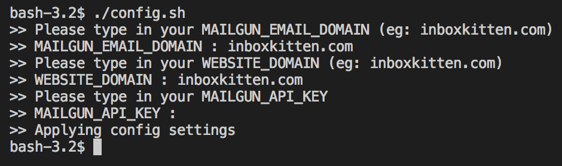

# Serverless Deployment Guide

Follow the steps guide below to get started on Cloudflare!

- [Step 0 - Clone Me](#step-0---clone-me)
- [Step 1 - Setup Cloudflare Workers](#step-1---setup-cloudflare-workers)
- [Step 2 - Configuration](#step-2---configuration)
- [Step 3 - Build the package](#step-3---build-the-package)
- [Step 4 - Deployment](#step-4---deployment)

> Also do let us know how we can help make this better 😺

## Step 0 - Clone Me

```
	$ git clone https://github.com/uilicious/inboxkitten.git
```

## Step 1 - Setup Cloudflare Workers

1. Go to <a href="https://cloudflare.com" target="_blank">Cloudflare</a> and signup with a domain.
2. Setup cloudflare worker and get an API key
___

## Step 2 - Configuration

In the root directory of Inboxkitten, run the following command
```
	$ ./config.sh
```

During the run time of `./config.sh`, there are three environment variables that is being used to set the configuration for your configuration files.

1. `MAILGUN_EMAIL_DOMAIN` - any custom domain that you owned or the default domain in Mailgun
2. `WEBSITE_DOMAIN`  - any custom domain that you owned.
3. `MAILGUN_API_KEY` - retrieve the api key from your Mailgun account



___

## Step 3 - Build the package

```
	$ ./build.sh
```

`./build.sh` will package the components to be ready for deployment.

___

## Step 4 - Deployment

For API deployment on Cloudflare:

```
	# Run the deployment script
	$ ./deploy/cloudflare/deploy.sh 
```