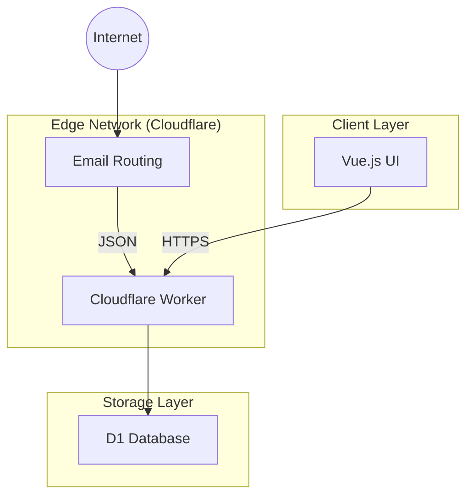

# System Architecture

## Overview

Akunlama is a disposable email service designed for speed and privacy. It leverages Cloudflare's edge network for high performance and low detailed infrastructure management.

## Components

### 1. Frontend (UI)
- **Framework**: Vue.js 3
- **Build Tool**: Vite
- **Styling**: SCSS / Vanilla CSS
- **Purpose**: Provides the user interface for generating random email addresses and reading inboxes.
- **Key Features**:
  - Local storage for session persistence.
  - Real-time updates via SSE (Server-Sent Events).
  - Responsive design.

### 2. Backend (Cloudflare Worker)
- **Runtime**: Cloudflare Workers (V8 Isolate)
- **Role**: Functions as both the API server and the Email Processor.
- **Entry Points**:
  - `fetch`: Handles HTTP API requests from the UI.
  - `email`: Handles incoming raw emails from Cloudflare Email Routing.
  - `scheduled`: Handles cron jobs (automated cleanup).

### 3. Database (Cloudflare D1)
- **Type**: SQLite (Serverless)
- **Schema**:
  - `emails` table: Stores email metadata and content.
- **Data Retention**: Emails are automatically deleted after a configured period (default: 3 days) to save space and maintain privacy.

## Data Flow

### Email Ingestion
1. Sender sends email to `anything@akunlama.com`.
2. Cloudflare Email Routing catches the mail.
3. A configured Rule forwards the email to the `akunlama-worker`.
4. The Worker's `email()` handler parses the MIME content.
5. Content is filtered (spam checks) and sanitized.
6. Details are stored in the D1 database.

### Email Retrieval
1. User opens UI, generates a random username (e.g., `user123`).
2. UI polls (or streams) `/api/events?recipient=user123`.
3. Worker queries D1 for emails matching `user123`.
4. Worker returns JSON list of emails.

### Cleanup
1. Cron trigger fires (e.g., every 12 hours).
2. Worker `scheduled()` handler executes `DELETE FROM emails WHERE received_at < ...`.
