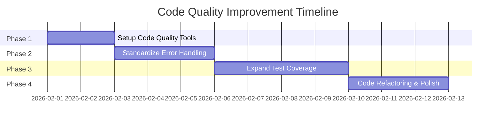

# Akunlama Codebase Quality Improvement Plan
**Goal:** Enhance code quality through linting, formatting, error handling consistency, and comprehensive testing without adding new features.

---

## Executive Summary

This plan addresses code quality improvements for the Akunlama disposable email service:
- **Code Quality Tools** - No linting/formatting configuration exists
- **Error Handling** - Inconsistent error handling patterns across the codebase
- **Test Coverage** - Limited test coverage, especially for the Cloudflare Worker
- **Code Consistency** - Some areas need refactoring for clarity and maintainability

The improvements are organized into **4 phases**, each building on the previous one:



---

## Phase 1: Setup Code Quality Tools

### Objective
Establish a foundation for consistent code quality through linting, formatting, and pre-commit hooks.

### Current State
- No ESLint configuration
- No Prettier configuration
- No pre-commit hooks
- No code style enforcement

### Tasks

#### 1.1 Configure ESLint for Cloudflare Worker
**File:** `cloudflare-email/.eslintrc.js` (new)

Create ESLint configuration for the Cloudflare Worker codebase:

```javascript
module.exports = {
    env: {
        browser: false,
        es2021: true,
        node: true,
        worker: true
    },
    extends: ['eslint:recommended'],
    parserOptions: {
        ecmaVersion: 'latest',
        sourceType: 'module'
    },
    rules: {
        // Error prevention
        'no-console': ['warn', { allow: ['error', 'warn'] }],
        'no-unused-vars': ['error', { argsIgnorePattern: '^_', varsIgnorePattern: '^_' }],
        'no-undef': 'error',
        'no-var': 'error',
        'prefer-const': 'error',
        'eqeqeq': ['error', 'always'],
        'curly': ['error', 'all'],
        
        // Code quality
        'no-duplicate-imports': 'error',
        'no-return-await': 'error',
        'require-await': 'error',
        'no-empty': ['error', { allowEmptyCatch: false }],
        
        // Style
        'indent': ['error', 4],
        'quotes': ['error', 'single', { avoidEscape: true }],
        'semi': ['error', 'always'],
        'comma-dangle': ['error', 'never'],
        'object-curly-spacing': ['error', 'always'],
        'array-bracket-spacing': ['error', 'never'],
        'space-before-function-paren': ['error', {
            anonymous: 'always',
            named: 'never',
            asyncArrow: 'always'
        }],
        'key-spacing': ['error', { beforeColon: false, afterColon: true }],
        'keyword-spacing': ['error', { before: true, after: true }],
        'no-multiple-empty-lines': ['error', { max: 1, maxEOF: 0 }],
        'no-trailing-spaces': 'error'
    }
};
```

#### 1.2 Configure ESLint for Vue UI
**File:** `ui/.eslintrc.js` (new)

Create ESLint configuration for the Vue.js frontend:

```javascript
module.exports = {
    env: {
        browser: true,
        es2021: true,
        node: true
    },
    extends: [
        'eslint:recommended',
        'plugin:vue/vue3-recommended'
    ],
    parserOptions: {
        ecmaVersion: 'latest',
        sourceType: 'module'
    },
    plugins: ['vue'],
    rules: {
        // Vue-specific rules
        'vue/multi-word-component-names': 'off',
        'vue/no-v-html': 'warn',
        'vue/require-default-prop': 'off',
        'vue/require-prop-types': 'off',
        
        // General rules
        'no-console': ['warn', { allow: ['error', 'warn'] }],
        'no-unused-vars': ['error', { argsIgnorePattern: '^_', varsIgnorePattern: '^_' }],
        'no-var': 'error',
        'prefer-const': 'error',
        'eqeqeq': ['error', 'always'],
        
        // Style
        'indent': ['error', 4],
        'quotes': ['error', 'single', { avoidEscape: true }],
        'semi': ['error', 'always'],
        'comma-dangle': ['error', 'never']
    }
};
```

#### 1.3 Configure Prettier
**Files:** 
- `.prettierrc` (new, root level)
- `.prettierignore` (new, root level)

Create Prettier configuration for consistent formatting:

```json
{
  "printWidth": 100,
  "tabWidth": 4,
  "useTabs": false,
  "semi": true,
  "singleQuote": true,
  "quoteProps": "as-needed",
  "trailingComma": "none",
  "bracketSpacing": true,
  "bracketSameLine": false,
  "arrowParens": "always",
  "endOfLine": "lf"
}
```

```gitignore
# .prettierignore
node_modules/
dist/
build/
coverage/
*.min.js
package-lock.json
pnpm-lock.yaml
yarn.lock
test-results/
```

#### 1.4 Configure Husky and lint-staged
**Files:**
- `.husky/pre-commit` (new)
- `.lintstagedrc.json` (new)

Set up pre-commit hooks to ensure code quality:

```json
// .lintstagedrc.json
{
  "cloudflare-email/**/*.{js,mjs}": [
    "eslint --fix",
    "prettier --write"
  ],
  "ui/**/*.{js,vue}": [
    "eslint --fix",
    "prettier --write"
  ],
  "ui/**/*.{css,scss}": [
    "prettier --write"
  ],
  "*.{json,md,yml,yaml}": [
    "prettier --write"
  ]
}
```

#### 1.5 Update package.json Scripts
**Files:** 
- `cloudflare-email/package.json` (new)
- `ui/package.json` (modify)

Add linting and formatting scripts:

**For Cloudflare Worker (create package.json):**
```json
{
  "name": "akunlama-worker",
  "version": "1.0.0",
  "type": "module",
  "scripts": {
    "lint": "eslint src/",
    "lint:fix": "eslint src/ --fix",
    "format": "prettier --write \"src/**/*.{js,mjs}\"",
    "format:check": "prettier --check \"src/**/*.{js,mjs}\"",
    "test": "vitest",
    "test:coverage": "vitest run --coverage",
    "prepare": "cd .. && husky install cloudflare-email/.husky"
  },
  "devDependencies": {
    "eslint": "^8.57.0",
    "husky": "^8.0.3",
    "lint-staged": "^15.2.0",
    "prettier": "^3.2.0",
    "vitest": "^1.0.4"
  }
}
```

**For UI (add to existing scripts):**
```json
{
  "scripts": {
    "lint": "eslint src/ --ext .js,.vue",
    "lint:fix": "eslint src/ --ext .js,.vue --fix",
    "format": "prettier --write \"src/**/*.{js,vue,css,scss}\"",
    "format:check": "prettier --check \"src/**/*.{js,vue,css,scss}\"",
    "prepare": "husky install"
  }
}
```

#### 1.6 Add Root-Level package.json for Shared Config
**File:** `package.json` (new, root level)

Create a root package.json for shared tooling:

```json
{
  "name": "akunlama",
  "version": "1.0.0",
  "private": true,
  "scripts": {
    "lint": "npm run lint --workspaces --if-present",
    "lint:fix": "npm run lint:fix --workspaces --if-present",
    "format": "npm run format --workspaces --if-present",
    "format:check": "npm run format:check --workspaces --if-present",
    "test": "npm run test --workspaces --if-present",
    "prepare": "husky install"
  },
  "devDependencies": {
    "husky": "^8.0.3",
    "lint-staged": "^15.2.0",
    "prettier": "^3.2.0"
  },
  "workspaces": [
    "cloudflare-email",
    "ui"
  ]
}
```

### Expected Outcomes
- ESLint and Prettier configured for both worker and UI
- Pre-commit hooks enforce code quality
- Consistent code formatting across the codebase
- Easy-to-run lint and format commands

---

## Phase 2: Standardize Error Handling

### Objective
Implement consistent error handling patterns across the entire codebase.

### Current State
- Mix of try-catch patterns
- Inconsistent error response formats
- Some functions don't handle errors at all
- No centralized error handling utilities

### Tasks

#### 2.1 Create Custom Error Classes
**File:** `cloudflare-email/src/utils/errors.js` (new)

Create a hierarchy of custom error classes:

```javascript
/**
 * Base API Error class
 */
export class ApiError extends Error {
    constructor(message, status = 500, code = 'INTERNAL_ERROR') {
        super(message);
        this.name = this.constructor.name;
        this.status = status;
        this.code = code;
    }
}

/**
 * Validation Error (400)
 */
export class ValidationError extends ApiError {
    constructor(message, field = null) {
        super(message, 400, 'VALIDATION_ERROR');
        this.field = field;
    }
}

/**
 * Authentication/Authorization Error (401/403)
 */
export class AuthenticationError extends ApiError {
    constructor(message = 'Unauthorized') {
        super(message, 401, 'AUTHENTICATION_ERROR');
    }
}

export class AuthorizationError extends ApiError {
    constructor(message = 'Forbidden') {
        super(message, 403, 'AUTHORIZATION_ERROR');
    }
}

/**
 * Not Found Error (404)
 */
export class NotFoundError extends ApiError {
    constructor(message = 'Resource not found') {
        super(message, 404, 'NOT_FOUND');
    }
}

/**
 * Rate Limit Error (429)
 */
export class RateLimitError extends ApiError {
    constructor(message = 'Rate limit exceeded') {
        super(message, 429, 'RATE_LIMIT_EXCEEDED');
    }
}

/**
 * Conflict Error (409)
 */
export class ConflictError extends ApiError {
    constructor(message = 'Resource conflict') {
        super(message, 409, 'CONFLICT');
    }
}
```

#### 2.2 Create Error Handler Middleware
**File:** `cloudflare-email/src/utils/error-handler.js` (new)

Create a centralized error handler:

```javascript
import { jsonResponse } from './http.js';
import { ApiError } from './errors.js';

/**
 * Log error with context
 */
const logError = (error, context = {}) => {
    const timestamp = new Date().toISOString();
    const logData = {
        timestamp,
        error: {
            name: error.name,
            message: error.message,
            code: error.code,
            status: error.status,
            stack: error.stack
        },
        context
    };

    if (error.status >= 500) {
        console.error('[ERROR]', JSON.stringify(logData));
    } else {
        console.warn('[WARN]', JSON.stringify(logData));
    }
};

/**
 * Handle API errors and return appropriate response
 */
export const handleApiError = (error, context = {}) => {
    logError(error, context);

    // If it's our custom ApiError, use its properties
    if (error instanceof ApiError) {
        return jsonResponse({
            error: error.message,
            code: error.code,
            ...(error.field && { field: error.field })
        }, error.status);
    }

    // Handle known error types
    if (error.name === 'SyntaxError' && error.message.includes('JSON')) {
        return jsonResponse({
            error: 'Invalid JSON in request body',
            code: 'INVALID_JSON'
        }, 400);
    }

    // Generic error response
    return jsonResponse({
        error: 'Internal server error',
        code: 'INTERNAL_ERROR'
    }, 500);
};

/**
 * Wrap async route handlers to catch errors
 */
export const asyncHandler = (fn) => {
    return async (request, url, env, ctx) => {
        try {
            return await fn(request, url, env, ctx);
        } catch (error) {
            return handleApiError(error, { handler: fn.name });
        }
    };
};

/**
 * Wrap scheduled handlers to catch errors
 */
export const asyncScheduledHandler = (fn) => {
    return async (event, env, ctx) => {
        try {
            return await fn(event, env, ctx);
        } catch (error) {
            logError(error, { handler: fn.name, type: 'scheduled' });
            throw error; // Re-throw for Cloudflare to handle
        }
    };
};

/**
 * Wrap email handlers to catch errors
 */
export const asyncEmailHandler = (fn) => {
    return async (message, env, ctx) => {
        try {
            return await fn(message, env, ctx);
        } catch (error) {
            logError(error, { handler: fn.name, type: 'email', recipient: message.to });
            throw error; // Re-throw for Cloudflare to handle
        }
    };
};
```

#### 2.3 Refactor Route Handlers with Error Handling
**File:** `cloudflare-email/src/handlers/api.js` (modify)

Update the main API handler to use error handling middleware:

```javascript
import { createHeaders, jsonResponse } from '../utils/http.js';
import { handleEvents } from '../routes/events.js';
import { handleStream } from '../routes/stream.js';
import { handleGetEmail, handleMarkRead } from '../routes/email-content.js';
import { handleList, handleGetKey, handleGetHtml } from '../routes/legacy.js';
import { handleHealth, handleDebug, handleCleanup } from '../routes/admin.js';
import { handleApiError } from '../utils/error-handler.js';

// Route Registry
const ROUTES = {
    // ============================================
    // LEGACY REDIRECTS (301)
    // ============================================
    '/api/v1/mail/list': { redirect: '/api/list', status: 301 },
    '/api/v1/mail/getHtml': { redirect: '/api/getHtml', status: 301 },
    '/api/v1/mail/getKey': { redirect: '/api/getKey', status: 301 },

    // ============================================
    // MAIN API ROUTES
    // ============================================
    '/api/events': { handler: handleEvents, methods: ['GET'] },
    '/api/stream': { handler: handleStream, methods: ['GET'] },

    // ============================================
    // LEGACY API ROUTES
    // ============================================
    '/api/list': { handler: handleList, methods: ['GET'] },
    '/api/getKey': { handler: handleGetKey, methods: ['GET'] },
    '/api/getHtml': { handler: handleGetHtml, methods: ['GET'] },

    // ============================================
    // ADMIN ROUTES
    // ============================================
    '/api/health': { handler: handleHealth, methods: ['GET'] },
    '/api/debug': { handler: handleDebug, methods: ['GET'] },
    '/api/cleanup': { handler: handleCleanup, methods: ['POST'] }
};

/**
 * HTTP fetch handler - API router with centralized error handling
 */
export async function handleFetch(request, env, ctx) {
    const url = new URL(request.url);
    const path = url.pathname;

    // Handle CORS preflight
    if (request.method === 'OPTIONS') {
        return new Response(null, { headers: createHeaders() });
    }

    try {
        // 1. Check Route Registry
        const route = ROUTES[path];

        if (route) {
            // Handle Redirects
            if (route.redirect) {
                const newUrl = new URL(url);
                newUrl.pathname = route.redirect;
                return Response.redirect(newUrl.toString(), route.status);
            }

            // Handle Methods
            if (route.handler) {
                if (route.methods && !route.methods.includes(request.method)) {
                    return jsonResponse({ 
                        error: 'Method not allowed', 
                        code: 'METHOD_NOT_ALLOWED' 
                    }, 405);
                }
                return await route.handler(request, url, env, ctx);
            }
        }

        // 2. Handle Dynamic Routes

        // GET /api/email/:id
        if (path.startsWith('/api/email/') && !path.includes('/read')) {
            const emailId = path.replace('/api/email/', '');
            return await handleGetEmail(request, url, emailId, env);
        }

        // PATCH /api/email/:id/read
        if (path.match(/^\/api\/email\/[^/]+\/read$/)) {
            if (request.method !== 'PATCH') {
                return jsonResponse({ 
                    error: 'Method not allowed', 
                    code: 'METHOD_NOT_ALLOWED' 
                }, 405);
            }
            const pathParts = path.split('/');
            const emailId = pathParts[3];
            return await handleMarkRead(request, url, emailId, env);
        }

        // 3. Fallback
        return jsonResponse({ 
            error: 'Not found', 
            code: 'NOT_FOUND' 
        }, 404);

    } catch (error) {
        return handleApiError(error, { path, method: request.method });
    }
}
```

#### 2.4 Refactor Route Handlers to Use Custom Errors
**File:** `cloudflare-email/src/routes/events.js` (modify)

Update route handlers to use custom error classes:

```javascript
// events.js - /api/events route handler with improved error handling

import { decodeMimeWords } from '../utils/mime.js';
import { jsonResponse, cachedJsonResponse, getClientIP } from '../utils/http.js';
import { validateUsername, extractUsername } from '../utils/validation.js';
import { checkRateLimit } from '../services/rate-limiter.js';
import { 
    ValidationError, 
    AuthenticationError, 
    RateLimitError 
} from '../utils/errors.js';

/**
 * Validate recipient parameter
 */
function validateRecipient(recipient) {
    if (!recipient?.trim()) {
        throw new ValidationError('Missing recipient parameter', 'recipient');
    }
    return recipient.trim();
}

/**
 * Handle admin request for all emails
 */
async function handleAdminRequest(url, env) {
    const adminKey = url.searchParams.get('admin_key');
    const validAdminKey = env.ADMIN_ACCESS_KEY;

    if (!validAdminKey || !adminKey || adminKey !== validAdminKey) {
        console.log('[SECURITY] Unauthorized admin access attempt');
        throw new AuthenticationError('Invalid admin access key');
    }

    console.log('[ADMIN] Authorized - Fetching all emails');
    const result = await env.DB.prepare(`
        SELECT id, recipient, sender, subject, preview, received_at, read_at 
        FROM emails 
        ORDER BY received_at DESC 
        LIMIT 100
    `).all();

    return result;
}

/**
 * Handle regular user request for specific recipient
 */
async function handleUserRequest(recipient, request, env) {
    const username = extractUsername(recipient);

    // Validate username format
    const validation = validateUsername(username, env);
    if (!validation.valid) {
        throw new ValidationError(validation.error, 'recipient');
    }

    // Apply rate limiting
    const clientIP = getClientIP(request);
    const rateCheck = checkRateLimit(username, clientIP);
    if (!rateCheck.allowed) {
        throw new RateLimitError(rateCheck.error);
    }

    // Add domain if missing
    let lookupRecipient = recipient;
    if (!lookupRecipient.includes('@')) {
        if (env.EMAIL_DOMAIN) {
            lookupRecipient = `${lookupRecipient}@${env.EMAIL_DOMAIN}`;
        } else {
            throw new ValidationError('EMAIL_DOMAIN is not configured', 'recipient');
        }
    }

    // Query D1
    const rawUsername = lookupRecipient.split('@')[0].toLowerCase();
    const fullEmail = rawUsername + '@' + (env.EMAIL_DOMAIN || 'akunlama.com');
    const normalizedRecipient = lookupRecipient.toLowerCase();

    // Use direct matches only - LIKE with leading wildcard causes full table scans
    const result = await env.DB.prepare(`
        SELECT id, recipient, sender, subject, preview, received_at, read_at 
        FROM emails 
        WHERE recipient = ? OR recipient = ?
        ORDER BY received_at DESC 
        LIMIT 50
    `).bind(normalizedRecipient, fullEmail).all();

    return result;
}

/**
 * GET /api/events?recipient=user@domain.com
 */
export async function handleEvents(request, url, env) {
    const recipient = validateRecipient(url.searchParams.get('recipient'));

    // Check for admin access (wildcard)
    const isAdminRequest = recipient === '*' || recipient === 'all';

    let dbResult;

    if (isAdminRequest) {
        dbResult = await handleAdminRequest(url, env);
    } else {
        dbResult = await handleUserRequest(recipient, request, env);
    }

    // Format response like Mailgun events API
    const items = dbResult.results.map(row => ({
        id: row.id,
        timestamp: row.received_at / 1000,
        event: 'stored',
        read_at: row.read_at ? row.read_at / 1000 : null,
        preview: row.preview || null,
        message: {
            headers: {
                from: row.sender,
                to: row.recipient,
                subject: decodeMimeWords(row.subject || '')
            }
        },
        storage: {
            key: row.id,
            url: `/api/email/${row.id}`
        }
    }));

    return cachedJsonResponse(request, { items }, 200, 15);
}
```

#### 2.5 Update Other Route Handlers
**Files:** 
- `cloudflare-email/src/routes/email-content.js` (modify)
- `cloudflare-email/src/routes/stream.js` (modify)
- `cloudflare-email/src/routes/legacy.js` (modify)
- `cloudflare-email/src/routes/admin.js` (modify)

Apply the same error handling pattern to all route handlers.

#### 2.6 Add Error Handling to Email Handler
**File:** `cloudflare-email/src/handlers/email.js` (modify)

Update the email handler with better error handling:

```javascript
// email.js - Inbound email handler with improved error handling

import {
    splitHeadersAndBody,
    parseHeaders,
    parseContentType,
    decodeContent,
    decodeMimeWords,
    parseMultipartBody,
    truncate
} from '../utils/mime.js';
import { shouldBlockEmail } from '../services/email-filter.js';
import { logError } from '../utils/error-handler.js';

/**
 * Extract bodies (html, text) from raw email content
 */
const extractBodiesFromRaw = (rawEmail) => {
    const [headerText, bodyText] = splitHeadersAndBody(rawEmail);
    const headers = parseHeaders(headerText);
    const contentType = parseContentType(headers['content-type']);
    const encoding = headers['content-transfer-encoding'];

    if (contentType.mime.startsWith('multipart/') && contentType.params.boundary) {
        return parseMultipartBody(bodyText, contentType.params.boundary);
    }

    const decoded = decodeContent(bodyText, encoding, contentType.params.charset);
    if (contentType.mime === 'text/html') {
        return { html: decoded, text: '' };
    }
    return { html: '', text: decoded };
};

/**
 * Email handler - processes inbound emails from Cloudflare Email Routing
 */
export async function handleEmail(message, env, ctx) {
    try {
        const rawEmail = await new Response(message.raw).text();
        const [headerText] = splitHeadersAndBody(rawEmail);
        const headers = parseHeaders(headerText);

        const subjectRaw = headers['subject'] || message.headers?.get?.('subject') || '(No Subject)';
        const subject = decodeMimeWords(subjectRaw) || '(No Subject)';
        const sender = headers['from'] || message.from;

        // Extract clean email address from "To" header
        const rawTo = headers['to'] || message.to;
        let recipient = rawTo;
        const emailMatch = rawTo.match(/<([^>]+)>/);
        if (emailMatch) {
            recipient = emailMatch[1];
        } else if (rawTo.includes('@')) {
            recipient = rawTo.trim();
        }
        // Normalize to lowercase
        recipient = recipient.toLowerCase();

        const { html, text } = extractBodiesFromRaw(rawEmail);

        // EMAIL FILTERING - Block unwanted emails before storage
        const filterResult = shouldBlockEmail(sender, subject, text || html, env);
        if (filterResult.blocked) {
            console.log(`[FILTER] Email blocked for ${recipient}: ${filterResult.reason}`);
            return; // Don't store - saves D1 quota
        }

        const emailId = crypto.randomUUID();

        // Generate preview from text (first 100 chars)
        const previewText = (text || html || '')
            .replace(/<[^>]*>/g, '') // Strip HTML tags
            .replace(/\s+/g, ' ')    // Normalize whitespace
            .trim()
            .substring(0, 100);

        await env.DB.prepare(`
            INSERT INTO emails (id, recipient, sender, subject, body_html, body_text, preview, received_at)
            VALUES (?, ?, ?, ?, ?, ?, ?, ?)
        `).bind(
            emailId,
            recipient,
            sender,
            subject,
            truncate(html),
            truncate(text),
            previewText || null,
            Date.now()
        ).run();

        console.log(`Email stored: ${emailId} for ${recipient}`);

    } catch (error) {
        logError(error, { 
            type: 'email_handler', 
            to: message.to,
            from: message.from 
        });
        // Don't throw - we don't want to bounce emails on processing errors
    }
}
```

### Expected Outcomes
- Consistent error handling across all handlers
- Custom error classes for different error types
- Centralized error logging
- Better error messages for API consumers

---

## Phase 3: Expand Test Coverage

### Objective
Increase test coverage for critical functionality, especially the Cloudflare Worker.

### Current State
- Cloudflare Worker: Only 2 unit tests (mime.test.js, rate-limiter.test.js)
- UI: Good unit test coverage, E2E tests exist
- No integration tests for API endpoints
- No tests for services (email-filter, cleanup, validation)

### Tasks

#### 3.1 Create Test Configuration for Worker
**File:** `cloudflare-email/vitest.config.js` (new)

Create Vitest configuration for the Cloudflare Worker:

```javascript
import { defineConfig } from 'vitest/config';

export default defineConfig({
    test: {
        environment: 'jsdom',
        globals: true,
        coverage: {
            provider: 'v8',
            reporter: ['text', 'json', 'html'],
            exclude: [
                'node_modules/',
                'tests/',
                '**/*.test.js',
                '**/*.spec.js'
            ]
        }
    }
});
```

#### 3.2 Add Tests for Email Filter Service
**File:** `cloudflare-email/tests/unit/email-filter.test.js` (new)

```javascript
import { describe, it, expect, beforeEach } from 'vitest';
import { shouldBlockEmail, loadKeywordsFromEnv } from '../../src/services/email-filter.js';

describe('Email Filter Service', () => {
    const mockEnv = {
        BLOCKED_SENDER_KEYWORDS: 'spam@example.com,marketing@test.com',
        BLOCKED_SUBJECT_KEYWORDS: 'viagra,casino,lottery',
        BLOCKED_BODY_KEYWORDS: 'click here to claim,unsubscribe now'
    };

    describe('loadKeywordsFromEnv', () => {
        it('should load keywords from environment variable', () => {
            const keywords = loadKeywordsFromEnv(mockEnv, 'BLOCKED_SENDER_KEYWORDS');
            expect(keywords).toEqual(['spam@example.com', 'marketing@test.com']);
        });

        it('should handle empty environment variable', () => {
            const keywords = loadKeywordsFromEnv({}, 'BLOCKED_SENDER_KEYWORDS');
            expect(keywords).toEqual([]);
        });

        it('should trim and lowercase keywords', () => {
            const keywords = loadKeywordsFromEnv(
                { KEY: '  SPAM@example.com ,  Test@TEST.COM  ' },
                'KEY'
            );
            expect(keywords).toEqual(['spam@example.com', 'test@test.com']);
        });
    });

    describe('shouldBlockEmail', () => {
        it('should block emails from default blocked sender patterns', () => {
            const result = shouldBlockEmail(
                'notification@facebookmail.com',
                'Test Subject',
                'Test Body',
                {}
            );
            expect(result.blocked).toBe(true);
            expect(result.reason).toContain('sender matches default pattern');
        });

        it('should block emails from configurable sender keywords', () => {
            const result = shouldBlockEmail(
                'spam@example.com',
                'Test Subject',
                'Test Body',
                mockEnv
            );
            expect(result.blocked).toBe(true);
            expect(result.reason).toContain('sender contains blocked keyword');
        });

        it('should block emails with default subject patterns (regex)', () => {
            const result = shouldBlockEmail(
                'test@example.com',
                '123456 is your confirmation code',
                'Test Body',
                {}
            );
            expect(result.blocked).toBe(true);
            expect(result.reason).toContain('subject matches default pattern');
        });

        it('should block emails with configurable subject keywords', () => {
            const result = shouldBlockEmail(
                'test@example.com',
                'You won a lottery!',
                'Test Body',
                mockEnv
            );
            expect(result.blocked).toBe(true);
            expect(result.reason).toContain('subject contains blocked keyword');
        });

        it('should block emails with configurable body keywords', () => {
            const result = shouldBlockEmail(
                'test@example.com',
                'Test Subject',
                'Click here to claim your prize!',
                mockEnv
            );
            expect(result.blocked).toBe(true);
            expect(result.reason).toContain('body contains blocked keyword');
        });

        it('should not block legitimate emails', () => {
            const result = shouldBlockEmail(
                'friend@example.com',
                'Hello from a friend',
                'How are you doing?',
                mockEnv
            );
            expect(result.blocked).toBe(false);
            expect(result.reason).toBeNull();
        });

        it('should handle null/undefined inputs gracefully', () => {
            const result = shouldBlockEmail(null, null, null, mockEnv);
            expect(result.blocked).toBe(false);
        });
    });
});
```

#### 3.3 Add Tests for Validation Utils
**File:** `cloudflare-email/tests/unit/validation.test.js` (new)

```javascript
import { describe, it, expect } from 'vitest';
import {
    validateUsername,
    getBannedUsernames,
    extractUsername,
    normalizeRecipient
} from '../../src/utils/validation.js';

describe('Validation Utils', () => {
    describe('getBannedUsernames', () => {
        it('should return empty set when env variable is empty', () => {
            const result = getBannedUsernames({});
            expect(result).toBeInstanceOf(Set);
            expect(result.size).toBe(0);
        });

        it('should parse comma-separated usernames', () => {
            const env = { BANNED_USERNAMES: 'admin,root,test' };
            const result = getBannedUsernames(env);
            expect(result).toBeInstanceOf(Set);
            expect(result.has('admin')).toBe(true);
            expect(result.has('root')).toBe(true);
            expect(result.has('test')).toBe(true);
        });

        it('should lowercase usernames', () => {
            const env = { BANNED_USERNAMES: 'Admin,ROOT,Test' };
            const result = getBannedUsernames(env);
            expect(result.has('admin')).toBe(true);
            expect(result.has('root')).toBe(true);
            expect(result.has('test')).toBe(true);
        });
    });

    describe('validateUsername', () => {
        const mockEnv = { BANNED_USERNAMES: 'admin,root' };

        it('should reject empty username', () => {
            const result = validateUsername('', mockEnv);
            expect(result.valid).toBe(false);
            expect(result.error).toContain('Username is required');
        });

        it('should reject null username', () => {
            const result = validateUsername(null, mockEnv);
            expect(result.valid).toBe(false);
        });

        it('should reject banned usernames', () => {
            const result = validateUsername('admin', mockEnv);
            expect(result.valid).toBe(false);
            expect(result.error).toContain('not allowed');
        });

        it('should reject usernames with invalid characters', () => {
            const result = validateUsername('user@name', mockEnv);
            expect(result.valid).toBe(false);
            expect(result.error).toContain('invalid characters');
        });

        it('should reject usernames starting with special characters', () => {
            const result = validateUsername('_username', mockEnv);
            expect(result.valid).toBe(false);
        });

        it('should accept valid usernames', () => {
            const result = validateUsername('user123', mockEnv);
            expect(result.valid).toBe(true);
            expect(result.error).toBeNull();
        });

        it('should accept usernames with dots, underscores, and hyphens', () => {
            expect(validateUsername('user.name', mockEnv).valid).toBe(true);
            expect(validateUsername('user_name', mockEnv).valid).toBe(true);
            expect(validateUsername('user-name', mockEnv).valid).toBe(true);
        });
    });

    describe('extractUsername', () => {
        it('should extract username from email address', () => {
            const result = extractUsername('user@example.com');
            expect(result).toBe('user');
        });

        it('should return input if no @ symbol', () => {
            const result = extractUsername('username');
            expect(result).toBe('username');
        });
    });

    describe('normalizeRecipient', () => {
        const mockEnv = { EMAIL_DOMAIN: 'example.com' };

        it('should add domain if missing', () => {
            const result = normalizeRecipient('username', mockEnv);
            expect(result.success).toBe(true);
            expect(result.recipient).toBe('username@example.com');
        });

        it('should lowercase recipient', () => {
            const result = normalizeRecipient('Username@Example.COM', mockEnv);
            expect(result.success).toBe(true);
            expect(result.recipient).toBe('username@example.com');
        });

        it('should trim whitespace', () => {
            const result = normalizeRecipient('  username  ', mockEnv);
            expect(result.success).toBe(true);
            expect(result.recipient).toBe('username@example.com');
        });

        it('should return existing email unchanged', () => {
            const result = normalizeRecipient('user@test.com', mockEnv);
            expect(result.success).toBe(true);
            expect(result.recipient).toBe('user@test.com');
        });

        it('should return error if EMAIL_DOMAIN not configured', () => {
            const result = normalizeRecipient('username', {});
            expect(result.success).toBe(false);
            expect(result.error).toContain('EMAIL_DOMAIN is not configured');
        });
    });
});
```

#### 3.4 Add Tests for HTTP Utils
**File:** `cloudflare-email/tests/unit/http.test.js` (new)

```javascript
import { describe, it, expect } from 'vitest';
import {
    getClientIP,
    createHeaders,
    generateETag,
    jsonResponse,
    cachedJsonResponse
} from '../../src/utils/http.js';

describe('HTTP Utils', () => {
    describe('getClientIP', () => {
        it('should extract IP from CF-Connecting-IP header', () => {
            const mockRequest = {
                headers: {
                    get: (name) => {
                        const headers = {
                            'CF-Connecting-IP': '192.168.1.1',
                            'X-Real-IP': '10.0.0.1',
                            'X-Forwarded-For': '172.16.0.1'
                        };
                        return headers[name];
                    }
                }
            };
            const result = getClientIP(mockRequest);
            expect(result).toBe('192.168.1.1');
        });

        it('should fall back to X-Real-IP', () => {
            const mockRequest = {
                headers: {
                    get: (name) => {
                        const headers = {
                            'X-Real-IP': '10.0.0.1',
                            'X-Forwarded-For': '172.16.0.1'
                        };
                        return headers[name];
                    }
                }
            };
            const result = getClientIP(mockRequest);
            expect(result).toBe('10.0.0.1');
        });

        it('should fall back to X-Forwarded-For', () => {
            const mockRequest = {
                headers: {
                    get: (name) => {
                        const headers = {
                            'X-Forwarded-For': '172.16.0.1, 192.168.1.1'
                        };
                        return headers[name];
                    }
                }
            };
            const result = getClientIP(mockRequest);
            expect(result).toBe('172.16.0.1');
        });

        it('should return unknown if no IP headers found', () => {
            const mockRequest = {
                headers: {
                    get: () => null
                }
            };
            const result = getClientIP(mockRequest);
            expect(result).toBe('unknown');
        });
    });

    describe('createHeaders', () => {
        it('should create default headers', () => {
            const headers = createHeaders();
            expect(headers.get('Content-Type')).toBe('application/json');
            expect(headers.get('Access-Control-Allow-Origin')).toBe('*');
            expect(headers.get('X-Content-Type-Options')).toBe('nosniff');
        });

        it('should merge additional headers', () => {
            const headers = createHeaders({ 'X-Custom-Header': 'custom-value' });
            expect(headers.get('X-Custom-Header')).toBe('custom-value');
            expect(headers.get('Content-Type')).toBe('application/json');
        });
    });

    describe('generateETag', () => {
        it('should generate consistent ETag for same data', () => {
            const data = { test: 'value' };
            const etag1 = generateETag(data);
            const etag2 = generateETag(data);
            expect(etag1).toBe(etag2);
        });

        it('should generate different ETags for different data', () => {
            const etag1 = generateETag({ test: 'value1' });
            const etag2 = generateETag({ test: 'value2' });
            expect(etag1).not.toBe(etag2);
        });

        it('should return quoted string', () => {
            const etag = generateETag({ test: 'value' });
            expect(etag).toMatch(/^".*"$/);
        });
    });

    describe('jsonResponse', () => {
        it('should create JSON response with default status', () => {
            const response = jsonResponse({ test: 'value' });
            expect(response.status).toBe(200);
            expect(response.headers.get('Content-Type')).toBe('application/json');
        });

        it('should create JSON response with custom status', () => {
            const response = jsonResponse({ error: 'Not found' }, 404);
            expect(response.status).toBe(404);
        });

        it('should include additional headers', () => {
            const response = jsonResponse({ test: 'value' }, 200, { 'X-Custom': 'value' });
            expect(response.headers.get('X-Custom')).toBe('value');
        });
    });

    describe('cachedJsonResponse', () => {
        it('should return 304 if ETag matches', () => {
            const data = { test: 'value' };
            const mockRequest = {
                headers: {
                    get: (name) => {
                        const headers = {
                            'If-None-Match': generateETag(data)
                        };
                        return headers[name];
                    }
                }
            };
            const response = cachedJsonResponse(mockRequest, data);
            expect(response.status).toBe(304);
        });

        it('should return 200 if ETag does not match', () => {
            const data = { test: 'value' };
            const mockRequest = {
                headers: {
                    get: () => null
                }
            };
            const response = cachedJsonResponse(mockRequest, data);
            expect(response.status).toBe(200);
            expect(response.headers.get('ETag')).toBeTruthy();
        });

        it('should include cache headers', () => {
            const data = { test: 'value' };
            const mockRequest = {
                headers: {
                    get: () => null
                }
            };
            const response = cachedJsonResponse(mockRequest, data, 200, 30);
            expect(response.headers.get('Cache-Control')).toContain('max-age=30');
        });
    });
});
```

#### 3.5 Add Tests for Cleanup Service
**File:** `cloudflare-email/tests/unit/cleanup.test.js` (new)

```javascript
import { describe, it, expect, vi, beforeEach } from 'vitest';
import { runCleanup } from '../../src/services/cleanup.js';

describe('Cleanup Service', () => {
    let mockEnv;

    beforeEach(() => {
        mockEnv = {
            DB: {
                prepare: vi.fn()
            }
        };
    });

    it('should delete old emails in batches', async () => {
        const mockResult = { meta: { changes: 1000 } };
        mockEnv.DB.prepare.mockReturnValue({
            bind: vi.fn().mockReturnValue({
                run: vi.fn().mockResolvedValue(mockResult)
            })
        });

        const result = await runCleanup(mockEnv);

        expect(result.success).toBe(true);
        expect(result.deleted).toBeGreaterThan(0);
    });

    it('should delete spam patterns', async () => {
        const mockResult = { meta: { changes: 50 } };
        mockEnv.DB.prepare.mockReturnValue({
            bind: vi.fn().mockReturnValue({
                run: vi.fn().mockResolvedValue(mockResult)
            })
        });

        await runCleanup(mockEnv);

        expect(mockEnv.DB.prepare).toHaveBeenCalled();
    });

    it('should handle database errors gracefully', async () => {
        mockEnv.DB.prepare.mockReturnValue({
            bind: vi.fn().mockReturnValue({
                run: vi.fn().mockRejectedValue(new Error('Database error'))
            })
        });

        const result = await runCleanup(mockEnv);

        expect(result.success).toBe(false);
        expect(result.error).toBe('Database error');
    });

    it('should limit total deletions per run', async () => {
        const mockResult = { meta: { changes: 1000 } };
        mockEnv.DB.prepare.mockReturnValue({
            bind: vi.fn().mockReturnValue({
                run: vi.fn().mockResolvedValue(mockResult)
            })
        });

        const result = await runCleanup(mockEnv);

        // Should not exceed 20000 deletions
        expect(result.deleted).toBeLessThanOrEqual(20000);
    });
});
```

#### 3.6 Add Integration Tests for API Endpoints
**File:** `cloudflare-email/tests/integration/api-events.test.js` (new)

```javascript
import { describe, it, expect, beforeEach, vi } from 'vitest';
import { handleEvents } from '../../src/routes/events.js';
import { ValidationError, AuthenticationError, RateLimitError } from '../../src/utils/errors.js';

describe('API Integration: /api/events', () => {
    let mockEnv;
    let mockRequest;
    let mockUrl;

    beforeEach(() => {
        mockEnv = {
            DB: {
                prepare: vi.fn().mockReturnValue({
                    bind: vi.fn().mockReturnValue({
                        all: vi.fn().mockResolvedValue({
                            results: [
                                {
                                    id: 'test-id-1',
                                    recipient: 'user@example.com',
                                    sender: 'sender@example.com',
                                    subject: 'Test Subject',
                                    preview: 'Test preview...',
                                    received_at: Date.now(),
                                    read_at: null
                                }
                            ]
                        })
                    })
                })
            },
            EMAIL_DOMAIN: 'example.com',
            ADMIN_ACCESS_KEY: 'secret-key'
        };

        mockRequest = {
            headers: {
                get: vi.fn((name) => {
                    const headers = {
                        'CF-Connecting-IP': '192.168.1.1'
                    };
                    return headers[name];
                })
            }
        };

        mockUrl = {
            searchParams: {
                get: vi.fn()
            }
        };
    });

    it('should return emails for valid recipient', async () => {
        mockUrl.searchParams.get.mockReturnValue('user@example.com');

        const response = await handleEvents(mockRequest, mockUrl, mockEnv);
        const data = await response.json();

        expect(response.status).toBe(200);
        expect(data.items).toBeDefined();
        expect(data.items.length).toBeGreaterThan(0);
        expect(data.items[0]).toHaveProperty('id');
        expect(data.items[0]).toHaveProperty('message');
    });

    it('should return 400 for missing recipient', async () => {
        mockUrl.searchParams.get.mockReturnValue(null);

        await expect(handleEvents(mockRequest, mockUrl, mockEnv)).rejects.toThrow(ValidationError);
    });

    it('should return 403 for invalid admin key', async () => {
        mockUrl.searchParams.get.mockReturnValue('*');

        const response = await handleEvents(mockRequest, mockUrl, mockEnv);
        const data = await response.json();

        expect(response.status).toBe(403);
        expect(data.error).toContain('Unauthorized');
    });

    it('should return 403 for valid admin key', async () => {
        mockUrl.searchParams.get
            .mockReturnValueOnce('*')
            .mockReturnValueOnce('secret-key');

        const response = await handleEvents(mockRequest, mockUrl, mockEnv);
        const data = await response.json();

        expect(response.status).toBe(200);
        expect(data.items).toBeDefined();
    });
});
```

#### 3.7 Update UI Tests for Better Coverage
**Files:** 
- `ui/tests/unit/store/emailStore.spec.js` (modify)
- Add tests for API service layer

### Expected Outcomes
- Comprehensive test coverage for Cloudflare Worker services
- Integration tests for API endpoints
- Better error handling test coverage
- Test coverage reports for monitoring

---

## Phase 4: Code Refactoring & Polish

### Objective
Refactor code for clarity, maintainability, and consistency.

### Current State
- Some functions could be further simplified
- Some code duplication exists
- Inconsistent naming in some areas
- Missing inline comments in complex logic

### Tasks

#### 4.1 Refactor Long Functions
**Files:** Various route and service files

Break down any remaining long functions (>50 lines) into smaller, focused functions.

#### 4.2 Remove Code Duplication
**Files:** Various files

Identify and eliminate duplicate code patterns, especially in:
- Route handlers
- Validation logic
- Response formatting

#### 4.3 Add Inline Comments
**Files:** All source files

Add clear, concise comments explaining:
- Complex business logic
- Security considerations
- Performance optimizations
- Non-obvious code patterns

#### 4.4 Standardize Logging
**File:** `cloudflare-email/src/utils/logger.js` (new)

Create a centralized logging utility:

```javascript
/**
 * Centralized logging utility
 */
const LOG_LEVELS = {
    ERROR: 'ERROR',
    WARN: 'WARN',
    INFO: 'INFO',
    DEBUG: 'DEBUG'
};

const shouldLog = (level) => {
    const envLevel = process.env.LOG_LEVEL || 'INFO';
    const levels = [LOG_LEVELS.DEBUG, LOG_LEVELS.INFO, LOG_LEVELS.WARN, LOG_LEVELS.ERROR];
    return levels.indexOf(level) >= levels.indexOf(envLevel);
};

export const logger = {
    error: (message, context = {}) => {
        if (shouldLog(LOG_LEVELS.ERROR)) {
            console.error(`[${LOG_LEVELS.ERROR}] ${message}`, context);
        }
    },
    warn: (message, context = {}) => {
        if (shouldLog(LOG_LEVELS.WARN)) {
            console.warn(`[${LOG_LEVELS.WARN}] ${message}`, context);
        }
    },
    info: (message, context = {}) => {
        if (shouldLog(LOG_LEVELS.INFO)) {
            console.log(`[${LOG_LEVELS.INFO}] ${message}`, context);
        }
    },
    debug: (message, context = {}) => {
        if (shouldLog(LOG_LEVELS.DEBUG)) {
            console.log(`[${LOG_LEVELS.DEBUG}] ${message}`, context);
        }
    }
};
```

#### 4.5 Add Type Definitions (JSDoc)
**Files:** All source files

Add JSDoc comments for better IDE support and documentation:

```javascript
/**
 * Check rate limit for a username from a client IP
 * @param {string} username - The username to check
 * @param {string} clientIP - The client IP address
 * @returns {{allowed: boolean, error: string|null}} Rate limit check result
 */
export const checkRateLimit = (username, clientIP) => {
    // ...
};
```

#### 4.6 Update README with Code Quality Information
**File:** `README.md` (modify)

Add section about code quality tools and practices:

```markdown
## Code Quality

This project uses ESLint and Prettier for code quality and formatting:

```bash
# Lint code
npm run lint

# Fix linting issues
npm run lint:fix

# Format code
npm run format

# Run tests
npm run test

# Run tests with coverage
npm run test:coverage
```

Pre-commit hooks automatically lint and format changed files.
```

### Expected Outcomes
- Cleaner, more maintainable code
- Better code documentation
- Consistent logging patterns
- Improved developer experience

---

## Summary of Changes

### Files to Create

```
cloudflare-email/
├── .eslintrc.js                    # ESLint configuration
├── .prettierrc                     # Prettier configuration (root)
├── package.json                    # Worker package.json
├── vitest.config.js                # Vitest configuration
└── src/
    └── utils/
        ├── errors.js               # Custom error classes
        ├── error-handler.js        # Error handling middleware
        └── logger.js               # Centralized logging

cloudflare-email/tests/
├── unit/
│   ├── email-filter.test.js       # Email filter tests
│   ├── validation.test.js          # Validation tests
│   ├── http.test.js               # HTTP utils tests
│   └── cleanup.test.js            # Cleanup service tests
└── integration/
    └── api-events.test.js         # API integration tests

ui/
└── .eslintrc.js                    # Vue ESLint configuration

(root level)
├── .prettierrc                     # Prettier configuration
├── .prettierignore                 # Prettier ignore patterns
├── .husky/pre-commit               # Pre-commit hook
├── .lintstagedrc.json              # Lint-staged configuration
└── package.json                    # Root package.json
```

### Files to Modify

```
cloudflare-email/
├── src/
│   ├── handlers/
│   │   ├── api.js                  # Add error handling
│   │   └── email.js                # Add error handling
│   └── routes/
│       ├── events.js               # Use custom errors
│       ├── email-content.js        # Use custom errors
│       ├── stream.js               # Use custom errors
│       ├── legacy.js               # Use custom errors
│       └── admin.js                # Use custom errors

ui/
├── package.json                    # Add lint/format scripts

README.md                           # Add code quality section
```

---

## Risk Assessment

| Risk | Impact | Mitigation |
|------|--------|------------|
| Breaking changes during error handling refactoring | High | Thorough testing, incremental rollout |
| Pre-commit hooks blocking legitimate changes | Low | Configure reasonable rules, allow bypass |
| Test flakiness in integration tests | Medium | Use mocks, isolate dependencies |
| Performance impact from additional logging | Low | Use log levels, disable in production |
| Linting rules too strict for existing code | Medium | Start with recommended rules, gradually tighten |

---

## Success Metrics

After completing all phases, the codebase should achieve:

1. **Code Quality Tools**
   - ESLint configured and passing
   - Prettier configured and consistent formatting
   - Pre-commit hooks enforcing code quality
   - Linting and formatting scripts available

2. **Error Handling**
   - Consistent error handling across all handlers
   - Custom error classes for different error types
   - Centralized error logging
   - Clear error messages for API consumers

3. **Test Coverage**
   - Unit tests for all services and utilities
   - Integration tests for API endpoints
   - Test coverage report available
   - CI/CD integration for automated testing

4. **Code Quality**
   - All functions under 50 lines
   - No code duplication
   - JSDoc comments on all public functions
   - Consistent logging patterns

5. **Developer Experience**
   - Easy-to-run lint and format commands
   - Clear documentation of code quality standards
   - Automated code quality enforcement
   - Better IDE support through JSDoc

---

## Next Steps

1. Review this plan with the team
2. Approve the approach and timeline
3. Begin Phase 1: Setup Code Quality Tools
4. Complete phases sequentially
5. Conduct code reviews after each phase
6. Update this plan as needed during execution
