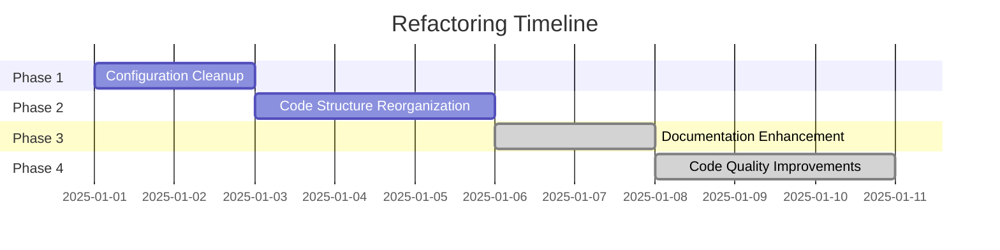
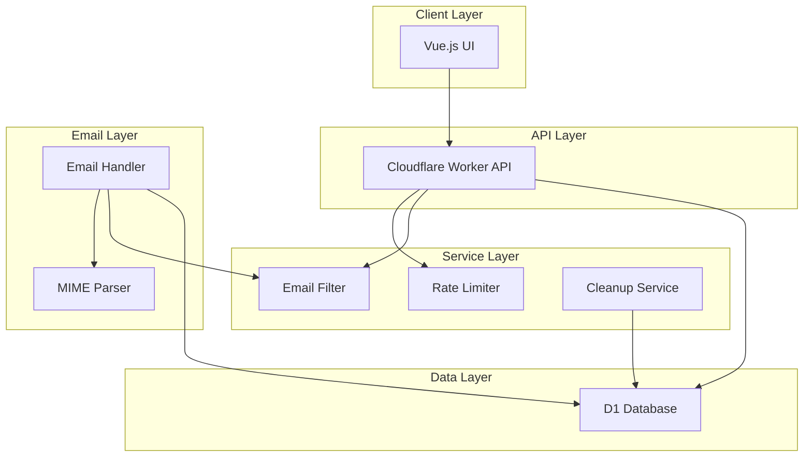

# Akunlama Codebase Refactoring Plan
**Goal:** Make the codebase easier to manage, read, and understand without adding new features.

---

## Executive Summary

This plan addresses key issues in the Akunlama disposable email service:
- **Configuration confusion** - Multiple config files and scattered environment variables
- **Code structure inconsistencies** - Mixed legacy/modern code, unclear entry points
- **Documentation gaps** - Missing architecture docs and developer guides
- **Code organization** - Files in unexpected locations, unclear separation of concerns

The refactoring is organized into **4 phases**, each building on the previous one:



---

## Phase 1: Configuration Cleanup

### Objective
Eliminate configuration confusion by consolidating all configuration into a single source of truth.

### Issues Identified
1. Multiple API config files (`apiconfig.js`, `apiconfig.vercel.js`, `apiconfig.cloudflare.js`)
2. Build scripts copy config files, causing confusion
3. Environment variables scattered across `wrangler.toml`, package.json, and `.env` files
4. No clear documentation of all available configuration options

### Tasks

#### 1.1 Consolidate UI Configuration
**File:** `ui/config/apiconfig.js`

- **Verification:** Confirm `apiconfig.js` is the single source of truth (consolidated files already deleted)
- Use environment variables with sensible defaults
- Update build scripts in `package.json` to remove references to missing config files

**Before:**
```javascript
// config/apiconfig.js
const config = {
    apiUrl: import.meta.env.VITE_API_URL || 'https://akunlama.com/api',
    domain: import.meta.env.VITE_WEBSITE_DOMAIN || 'akunlama.com',
    // ...
}
```

**After:**
```javascript
// config/apiconfig.js
const config = {
    // API Settings
    apiUrl: import.meta.env.VITE_API_URL || 'https://akunlama.com/api',
    domain: import.meta.env.VITE_WEBSITE_DOMAIN || 'akunlama.com',
    
    // Timeouts & Intervals
    autoRefreshInterval: parseInt(import.meta.env.VITE_AUTO_REFRESH_INTERVAL || '30000'),
    requestTimeout: parseInt(import.meta.env.VITE_REQUEST_TIMEOUT || '10000'),
    
    // UI Settings
    maxEmailsDisplay: parseInt(import.meta.env.VITE_MAX_EMAILS_DISPLAY || '50'),
    retentionPeriod: import.meta.env.VITE_RETENTION_PERIOD || '3 days',
    
    // Feature Flags
    enablePullToRefresh: import.meta.env.VITE_ENABLE_PULL_TO_REFRESH !== 'false',
    enableStreaming: import.meta.env.VITE_ENABLE_STREAMING !== 'false'
}
```

#### 1.2 Document All Environment Variables
**File:** `docs/configuration.md` (new)

Create comprehensive documentation of all environment variables:
- UI environment variables (VITE_*)
- Worker environment variables (wrangler.toml + secrets)
- Default values and acceptable ranges

#### 1.3 Create .env.example Files
**Files:** 
- `ui/.env.example`
- `cloudflare-email/.env.example`

Provide template files showing all available environment variables with example values.

#### 1.4 Update package.json Scripts
**File:** `ui/package.json`

Remove config copying scripts:
```json
{
  "scripts": {
    "build": "vite build",
    "dev": "vite",
    // Remove: "vercel-build", "cloudflare-build", "prebuild"
  }
}
```

### Expected Outcomes
- Single source of truth for configuration
- No more confusion about which config file is being used
- Clear documentation of all configuration options
- Simplified build process

---

## Phase 2: Code Structure Reorganization

### Objective
Reorganize code structure for clarity, consistency, and maintainability.

### Issues Identified
1. `cloudflare-email/email-worker.js` at root but actual entry point is `src/index.js`
2. Legacy routes duplicated in `api.js` (lines 27-46 duplicate lines 79-84)
3. `mime-utils.js` at root instead of in `src/utils/`
4. Inconsistent naming conventions
5. No clear separation between business logic and API layer

### Tasks

#### 2.1 Remove Confusing Entry Point
**Action:** Verify clean entry point

- `cloudflare-email/email-worker.js` does not exist (already cleaned up)
- Ensure `src/index.js` is the clear entry point defined in `wrangler.toml`

#### 2.2 Move mime-utils.js to Proper Location
**Action:** Move `cloudflare-email/mime-utils.js` → `cloudflare-email/src/utils/mime.js`

- Update all imports across the codebase
- Rename file to follow consistent naming convention

#### 2.3 Remove Duplicate Legacy Route Redirects
**File:** `cloudflare-email/src/handlers/api.js`

Remove duplicate code (lines 27-46 duplicate lines 79-84):

```javascript
// Remove this duplicate block (lines 27-46):
if (path === '/api/v1/mail/list') {
    const newUrl = new URL(url);
    newUrl.pathname = '/api/list';
    return Response.redirect(newUrl.toString(), 301);
}
// ... (other duplicates)
```

#### 2.4 Consolidate Route Handlers
**File:** `cloudflare-email/src/handlers/api.js`

Refactor to use a more maintainable routing pattern:

```javascript
// Create a route registry
const ROUTES = {
    // Legacy redirects
    '/api/v1/mail/list': { redirect: '/api/list', status: 301 },
    '/api/v1/mail/getHtml': { redirect: '/api/getHtml', status: 301 },
    '/api/v1/mail/getKey': { redirect: '/api/getKey', status: 301 },
    
    // Main API routes
    '/api/events': { handler: handleEvents, methods: ['GET'] },
    '/api/stream': { handler: handleStream, methods: ['GET'] },
    
    // Admin routes
    '/api/health': { handler: handleHealth, methods: ['GET'] },
    '/api/cleanup': { handler: handleCleanup, methods: ['POST'] }
};

// Use registry in handleFetch
export async function handleFetch(request, env, ctx) {
    const url = new URL(request.url);
    const path = url.pathname;
    
    // Check for redirects
    const redirectRoute = ROUTES[path];
    if (redirectRoute?.redirect) {
        const newUrl = new URL(url);
        newUrl.pathname = redirectRoute.redirect;
        return Response.redirect(newUrl.toString(), redirectRoute.status);
    }
    
    // Check for handlers
    const route = ROUTES[path];
    if (route?.handler) {
        if (!route.methods.includes(request.method)) {
            return jsonResponse({ error: 'Method not allowed' }, 405);
        }
        return route.handler(request, url, env, ctx);
    }
    
    // Handle dynamic routes
    if (path.startsWith('/api/email/')) {
        // ... existing logic
    }
    
    return jsonResponse({ error: 'Not found' }, 404);
}
```

#### 2.5 Standardize Naming Conventions
**Apply across codebase:**
- JavaScript files: `kebab-case.js`
- Vue components: `PascalCase.vue`
- SCSS files: `kebab-case.scss`
- Directory names: `kebab-case`

**Examples:**
- `email-filter.js` → `email-filter.js` (already correct)
- `mime-utils.js` → `mime.js` (when moved)
- All Vue components already follow PascalCase

#### 2.6 Create Architecture Diagram
**File:** `docs/architecture.md` (new)

Document the overall system architecture:



### Expected Outcomes
- Clear, consistent file structure
- No duplicate code
- Easier to find and modify code
- Better separation of concerns

---

## Phase 3: Documentation Enhancement

### Objective
Improve documentation to make the codebase easier to understand and contribute to.

### Issues Identified
1. No architecture documentation
2. No developer onboarding guide
3. Inconsistent code comments
4. Missing API documentation details

### Tasks

#### 3.1 Create Developer Onboarding Guide (Done)
**File:** `docs/developer-guide.md`

#### 3.2 Document API Endpoints in Detail (Done)
**File:** `docs/api.md`

For each endpoint, document:
- URL pattern
- HTTP methods
- Request parameters
- Response format
- Error codes
- Rate limits
- Examples

**Example:**
```markdown
## GET /api/events

List emails for a recipient (Mailgun-compatible format).

### Request

**Query Parameters:**
- `recipient` (required): Email address to fetch emails for
  - Format: `username@domain.com` or just `username`
  - Admin access: Use `*` or `all` with `admin_key` parameter
- `admin_key` (optional): Secret key for admin access

### Response

```json
{
  "items": [
    {
      "id": "uuid",
      "timestamp": 1234567890,
      "event": "stored",
      "read_at": null,
      "preview": "Email preview text...",
      "message": {
        "headers": {
          "from": "sender@example.com",
          "to": "user@akunlama.com",
          "subject": "Email Subject"
        }
      },
      "storage": {
        "key": "uuid",
        "url": "/api/email/uuid"
      }
    }
  ]
}
```

### Rate Limits
- 75 requests per minute per IP
- 10 unique usernames per minute per IP
- 50 requests per minute for the same username
```

#### 3.3 Add Inline Code Comments
**Files:** All source files

Add clear, concise comments explaining:
- Complex logic
- Business rules
- Security considerations
- Performance optimizations

**Example:**
```javascript
// Rate limiting: Track requests per IP to prevent abuse
// Note: In-memory storage means limits are approximate across Worker isolates
// For strict rate limiting, consider using Durable Objects
export const checkRateLimit = (username, clientIP) => {
    // ...
}
```

#### 3.4 Create Troubleshooting Guide (Done)
**File:** `docs/troubleshooting.md`

Include common issues and solutions:
- Deployment errors
- Database connection issues
- Email routing problems
- CORS issues
- Rate limiting issues

#### 3.5 Update README Files (Done)
**Files:** `README.md`, `ui/README.md`, `cloudflare-email/README.md`

Enhance with:
- Quick links to detailed documentation
- Clear project structure overview
- Contributing guidelines
- License and attribution

### Expected Outcomes
- Comprehensive documentation for developers
- Easier onboarding for new contributors
- Clear understanding of system architecture
- Better code comprehension

---

## Phase 4: Code Quality Improvements

### Objective
Improve code quality through refactoring, testing, and consistency improvements.

### Issues Identified
1. Some functions are too long (e.g., `handleEvents` is 112 lines)
2. Rate limiter uses in-memory Map with known limitations
3. No tests for Cloudflare Worker
4. Inconsistent error handling patterns
5. Some code duplication

### Tasks

#### 4.1 Refactor Long Functions
**File:** `cloudflare-email/src/routes/events.js`

Break down `handleEvents` into smaller, focused functions:

```javascript
#### 4.1 Refactor Long Functions (Done)
**File:** `cloudflare-email/src/routes/events.js`
    if (!recipient?.trim()) {
        return { valid: false, error: 'Missing recipient parameter' };
    }
    return { valid: true };
}

// Extract admin access logic
async function handleAdminRequest(url, env) {
    const adminKey = url.searchParams.get('admin_key');
    const validAdminKey = env.ADMIN_ACCESS_KEY;

    if (!validAdminKey || !adminKey || adminKey !== validAdminKey) {
        console.log('[SECURITY] Unauthorized admin access attempt');
        return { success: false, error: 'Unauthorized' };
    }

    console.log('[ADMIN] Authorized - Fetching all emails');
    const result = await env.DB.prepare(`
        SELECT id, recipient, sender, subject, preview, received_at, read_at 
        FROM emails 
        ORDER BY received_at DESC 
        LIMIT 100
    `).all();
    
    return { success: true, result };
}

// Extract user request logic
async function handleUserRequest(recipient, request, env) {
    const username = extractUsername(recipient);
    
    // Validate username
    const validation = validateUsername(username, env);
    if (!validation.valid) {
        return { success: false, error: validation.error };
    }
    
    // Apply rate limiting
    const clientIP = getClientIP(request);
    const rateCheck = checkRateLimit(username, clientIP);
    if (!rateCheck.allowed) {
        console.log(`[RATE LIMIT] ${clientIP} exceeded limit for ${username}`);
        return { success: false, error: rateCheck.error };
    }
    
    // Normalize recipient
    const lookupRecipient = normalizeRecipient(recipient, env);
    
    // Query emails
    const result = await queryEmails(lookupRecipient, env);
    return { success: true, result };
}

// Main handler becomes much cleaner
export async function handleEvents(request, url, env) {
    const recipient = url.searchParams.get('recipient');
    
    // Validate recipient
    const validation = validateRecipient(recipient, env);
    if (!validation.valid) {
        return jsonResponse({ error: validation.error }, 400);
    }
    
    const trimmedRecipient = recipient.trim();
    const isAdminRequest = trimmedRecipient === '*' || trimmedRecipient === 'all';
    
    let result;
    if (isAdminRequest) {
        const response = await handleAdminRequest(url, env);
        if (!response.success) {
            return jsonResponse({ error: response.error }, 403);
        }
        result = response.result;
    } else {
        const response = await handleUserRequest(trimmedRecipient, request, env);
        if (!response.success) {
            return jsonResponse({ error: response.error }, response.status || 400);
        }
        result = response.result;
    }
    
    // Format response
    const items = formatEmailItems(result.results);
    return cachedJsonResponse(request, { items }, 200, 15);
}
```

#### 4.2 Improve Error Handling Consistency
**Files:** All route handlers

Standardize error handling pattern:

```javascript
// Create error types
export class ValidationError extends Error {
    constructor(message) {
        super(message);
        this.name = 'ValidationError';
        this.status = 400;
    }
}

export class AuthenticationError extends Error {
    constructor(message) {
        super(message);
        this.name = 'AuthenticationError';
        this.status = 403;
    }
}

export class RateLimitError extends Error {
    constructor(message) {
        super(message);
        this.name = 'RateLimitError';
        this.status = 429;
    }
}

// Create error handler middleware
export function handleApiError(error) {
    console.error('[API Error]', error);
    
    if (error.status) {
        return jsonResponse({ error: error.message }, error.status);
    }
    
    return jsonResponse({ error: 'Internal server error' }, 500);
}
```

#### 4.3 Add Worker Tests
**Files:** `cloudflare-email/tests/` (new directory)

Create test suite for Cloudflare Worker:
- Unit tests for services (rate-limiter, email-filter)
- Integration tests for API endpoints
- Email parsing tests
- MIME decoding tests

**Example test structure:**
```
cloudflare-email/tests/
├── unit/
│   ├── rate-limiter.test.js
│   ├── email-filter.test.js
│   └── mime-utils.test.js
├── integration/
│   ├── api-events.test.js
│   └── api-email.test.js
└── fixtures/
    └── sample-emails/
```

#### 4.3 Add Worker Tests (Started)
**Files:** `cloudflare-email/tests/`

Created initial test structure and unit tests for utilities.
**File:** `docs/limitations.md` (new)

Document known technical limitations:
- In-memory rate limiting across Worker isolates
- Email size limits
- Database query performance considerations
- Email routing edge cases

#### 4.5 Add Code Quality Tools
**Files:** Root-level configuration files

Add linting and formatting:
- ESLint configuration for JavaScript
- Prettier configuration for consistent formatting
- Pre-commit hooks (Husky + lint-staged)

**Example `.eslintrc.js`:**
```javascript
module.exports = {
    env: {
        browser: true,
        es2021: true,
        node: true,
        worker: true
    },
    extends: ['eslint:recommended'],
    parserOptions: {
        ecmaVersion: 'latest',
        sourceType: 'module'
    },
    rules: {
        'no-console': 'warn',
        'no-unused-vars': ['error', { argsIgnorePattern: '^_' }]
    }
}
```

### Expected Outcomes
- More maintainable code with smaller, focused functions
- Consistent error handling
- Test coverage for critical functionality
- Better code quality through tooling
- Clear documentation of limitations

---

## Summary of Changes

### Files to Create
```
docs/
├── architecture.md          # System architecture documentation
├── configuration.md         # Environment variables reference
├── developer-guide.md       # Onboarding guide
├── api.md                   # API endpoint documentation
├── troubleshooting.md       # Common issues and solutions
└── limitations.md           # Known technical limitations

ui/
└── .env.example             # UI environment variables template

cloudflare-email/
├── .env.example             # Worker environment variables template
└── tests/                   # Test suite (new directory)
```

### Files to Modify
```
ui/
├── config/apiconfig.js      # Consolidate all config
├── package.json             # Remove config copying scripts

cloudflare-email/
├── src/handlers/api.js      # Remove duplicates, refactor routing
├── src/routes/events.js     # Break down long function
├── src/utils/mime.js        # Rename from mime-utils.js (moved)
└── src/utils/http.js        # Add error handling utilities
```

### Files to Delete
```
(Completed: `cloudflare-email/email-worker.js` does not exist)
(Completed: `apiconfig.vercel.js` and `apiconfig.cloudflare.js` are already deleted)
```

---

## Risk Assessment

| Risk | Impact | Mitigation |
|------|--------|------------|
| Breaking changes during refactoring | High | Test thoroughly, deploy incrementally |
| Configuration errors after consolidation | Medium | Use .env.example files, document changes |
| Performance regression from refactoring | Low | Monitor metrics, benchmark before/after |
| Loss of functionality during code reorganization | Low | Comprehensive testing, code review |

---

## Success Metrics

After completing all phases, the codebase should achieve:

1. **Configuration Clarity**
   - Single source of truth for all configuration
   - Zero confusion about which config file is active
   - Complete documentation of all environment variables

2. **Code Organization**
   - Consistent file naming conventions
   - Clear separation of concerns
   - No duplicate code

3. **Documentation Coverage**
   - Architecture documented with diagrams
   - API endpoints fully documented
   - Developer onboarding guide available

4. **Code Quality**
   - All functions under 50 lines
   - Consistent error handling
   - Test coverage for critical paths

5. **Maintainability**
   - New developers can onboard in under 1 day
   - Changes can be made with minimal confusion
   - Code review process is streamlined

---

## Next Steps

1. Review this plan with the team
2. Approve the approach and timeline
3. Begin Phase 1: Configuration Cleanup
4. Complete phases sequentially
5. Conduct code reviews after each phase
6. Update this plan as needed during execution
